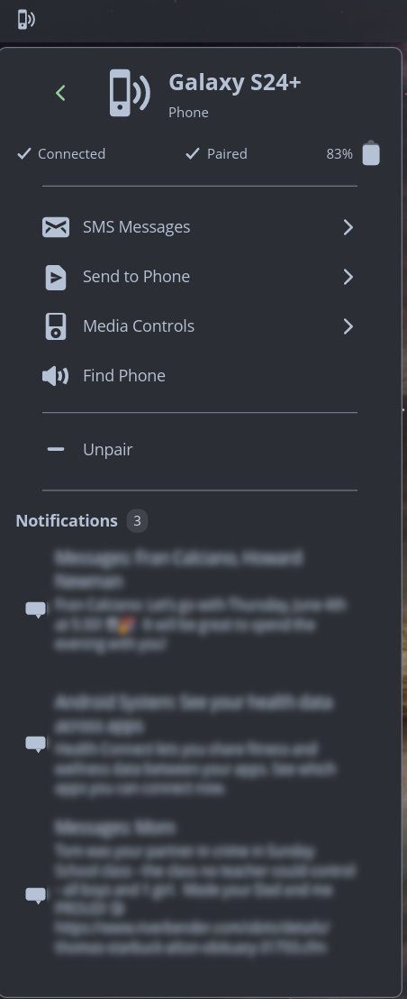

# Connected

A phone connectivity applet for the COSMIC™ desktop, powered by KDE Connect.



## Features

- **Device Management** - Pair, unpair, and monitor connected devices
- **SMS Messaging** - View conversations, reply, and compose new messages with contact lookup
- **File Sharing** - Send and receive files and URLs, with desktop notifications
- **Clipboard Sync** - Send clipboard content to your device
- **Notifications** - View and dismiss phone notifications; desktop alerts for SMS and calls (with privacy controls)
- **Battery Status** - Monitor battery level and charging state
- **Media Controls** - Control music playback (play/pause, next/previous, volume)
- **Find My Phone** - Ring or ping your phone to locate it

## Requirements

- [COSMIC Desktop Environment](https://github.com/pop-os/cosmic-epoch)
- [KDE Connect](https://kdeconnect.kde.org/) daemon (`kdeconnectd`)
- [KDE Connect Android app](https://play.google.com/store/apps/details?id=org.kde.kdeconnect_tp) (or from [F-Droid](https://f-droid.org/packages/org.kde.kdeconnect_tp/))
- Rust toolchain (for building from source) or Flatpak

## Installation

### KDE Connect on desktop and phone

Connected requires KDE Connect on both your desktop and Android phone.

1. **Desktop:**
   ```bash
   # Debian/Ubuntu/Pop!_OS
   sudo apt install kdeconnect

   # Fedora
   sudo dnf install kdeconnect

   # Arch
   sudo pacman -S kdeconnect
   ```

2. **Phone:** Install the KDE Connect app from [Google Play](https://play.google.com/store/apps/details?id=org.kde.kdeconnect_tp) or [F-Droid](https://f-droid.org/packages/org.kde.kdeconnect_tp/).

### Flatpak

1. **Install prerequisites:**
   ```bash
   flatpak install org.freedesktop.Sdk//24.08 org.freedesktop.Sdk.Extension.rust-stable//24.08 com.system76.Cosmic.BaseApp//stable
   ```

2. **Build and install:**
   ```bash
   git clone https://github.com/nwxnw/cosmic-ext-connected.git
   cd cosmic-ext-connected
   flatpak-builder --user --install --force-clean build-dir io.github.nwxnw.cosmic-ext-connected.json
   ```

3. **Add to panel:** Settings → Desktop → Panel → Applets → Add Applet → "Connected"

### From Source

1. **Install build dependencies:**
   ```bash
   # Debian/Ubuntu/Pop!_OS
   sudo apt install -y \
     build-essential cmake pkgconf \
     libxkbcommon-dev libwayland-dev libglvnd-dev \
     libexpat1-dev libfontconfig-dev libfreetype-dev \
     libgtk-3-dev libinput-dev libdbus-1-dev libssl-dev

   # Install just (task runner, used for install/uninstall)
   cargo install just
   ```

2. **Clone and build:**
   ```bash
   git clone https://github.com/nwxnw/cosmic-ext-connected.git
   cd cosmic-ext-connected
   cargo build --release
   ```

3. **Install to system:**
   ```bash
   sudo just install
   killall cosmic-panel  # Restart panel to pick up new applet
   ```

4. **Add to panel:** Settings → Desktop → Panel → Applets → Add Applet → "Connected"

### Uninstall

```bash
sudo just uninstall
```

## Usage

1. Ensure both devices are on the same network
2. Click the Connected applet in your panel — your phone should appear
3. Click your phone and select "Pair", then accept on your phone
4. **Important:** After pairing, enable the requested permissions in the KDE Connect app on your phone (SMS, Contacts, etc.)

## Configuration

Settings are accessible via the gear icon in the applet. Options include:

- **Show battery percentage** - Display battery level in device list
- **Show offline devices** - Show paired devices that aren't currently connected
- **File notifications** - Desktop notifications for received files
- **SMS notifications** - Desktop notifications for incoming SMS (with sender/content privacy options)
- **Call notifications** - Desktop notifications for incoming/missed calls (with name/number privacy options)

## Contributing

Contributions welcome! Please submit issues and pull requests.

See `CLAUDE.md` for detailed development documentation.

## License

GNU General Public License v3.0 - see [LICENSE](LICENSE).

## Acknowledgments

- [KDE Connect](https://kdeconnect.kde.org/) - The daemon that makes this possible
- [System76](https://system76.com/) / [libcosmic](https://github.com/pop-os/libcosmic) - The COSMIC desktop and UI toolkit
